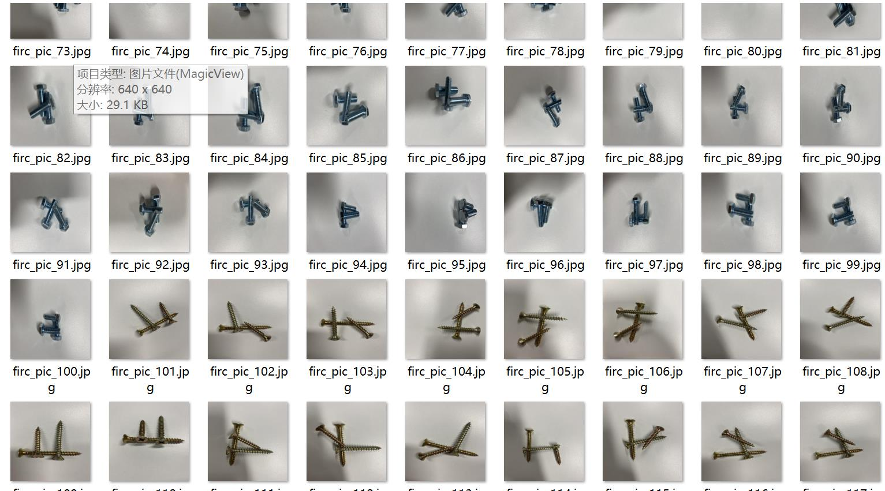
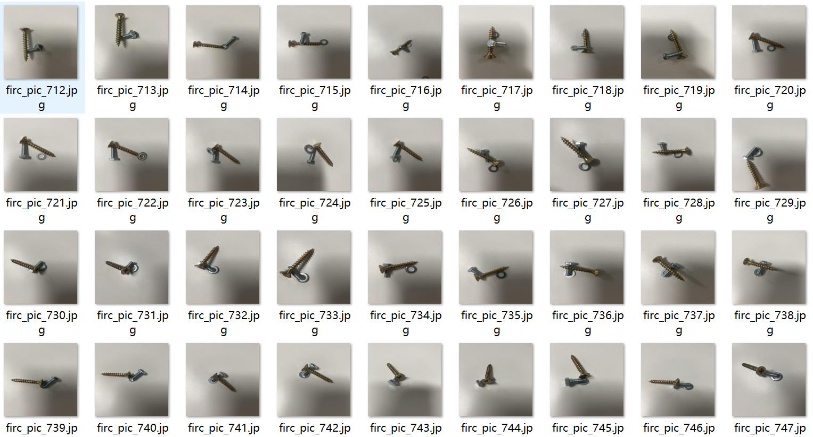
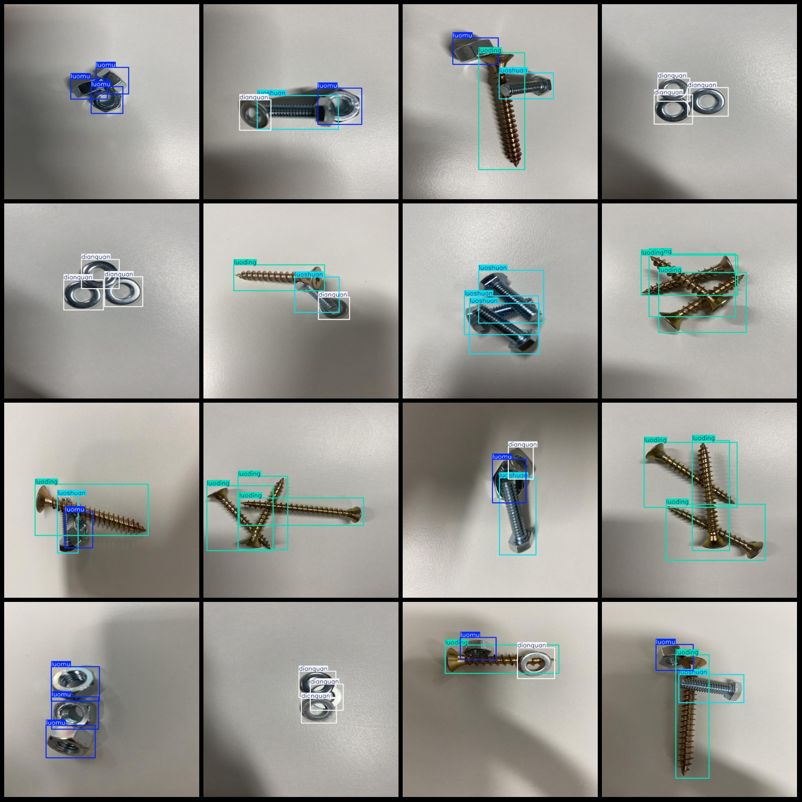
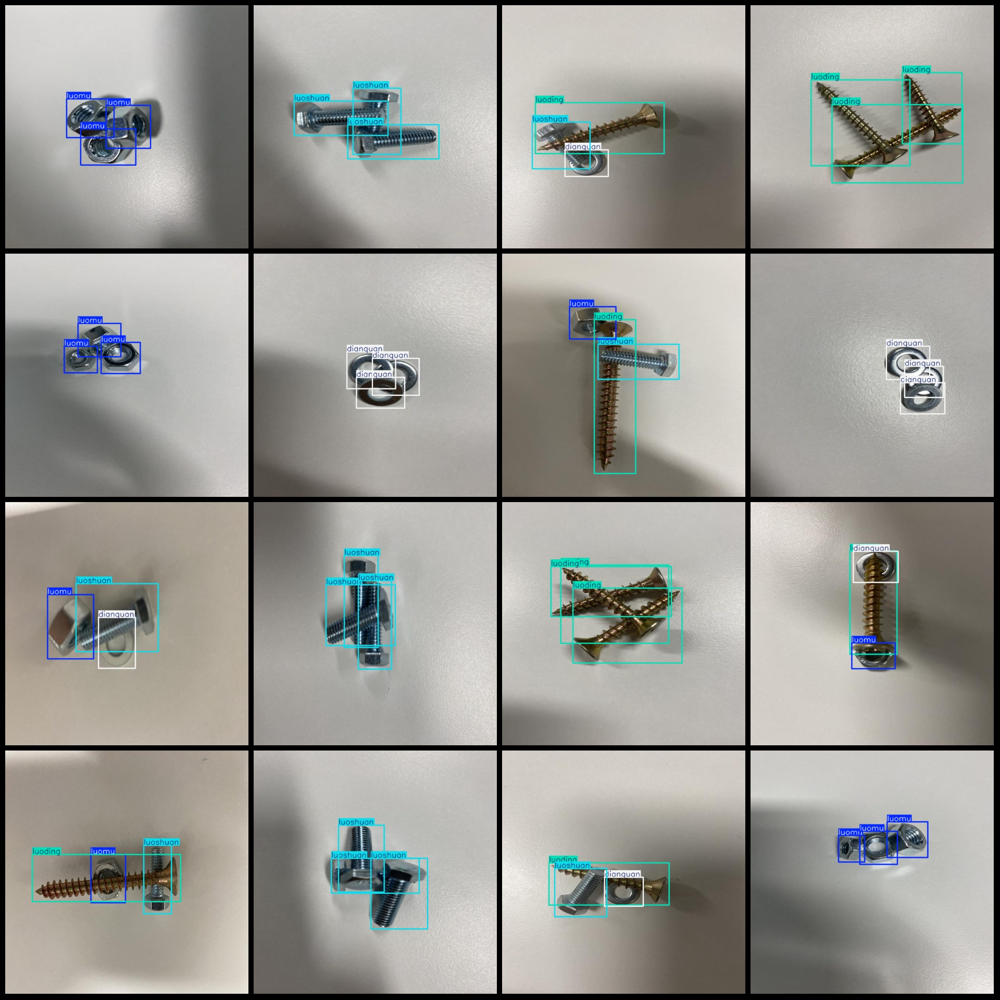

# Wisdom Industrial Screw Nut Bolt Gasket Detection Dataset VOC+YOLO Format with 800 Images and 4 Categories

Dataset format: Pascal VOC format plus YOLO format (txt file without split path, only containing jpg images along with corresponding VOC format xml files and YOLO format txt files)
Number of images (jpg file count): 800
Number of annotations (xml file count): 800
Number of annotations (txt file count): 800
Number of annotation categories: 4
Annotation category names (note that the order of categories in the YOLO format does not correspond to this, but is based on the labels folder 'classes.txt'): ["dianquan", "luoding", "luomu", 
"luoshuan"]
Each category has a number of bounding boxes:
dianquan = 597
luoding = 600
luomu = 601
luoshuan = 601
Total bounding box count: 2399
Each category occupies an image count:
dianquan = 398
luoding = 400
luomu = 400
luoshuan = 400
Image resolution: 640x640
Annotation tool used: labelImg
Annotation rules: draw bounding boxes for each category
Important note: The dataset does not have separate training, validation, or test sets; you will need to manually divide them.
Special declaration: This dataset does not guarantee any accuracy of the trained model or weight files.
Image preview:
Annotation example:

## Images

Here is a pay link on Stripe ( https://buy.stripe.com/3cs8yP7sY87d0vu9AB ). Please contact me lonlonago@foxmail.com after funding $89, and I will send you a complete data files , thank you!

